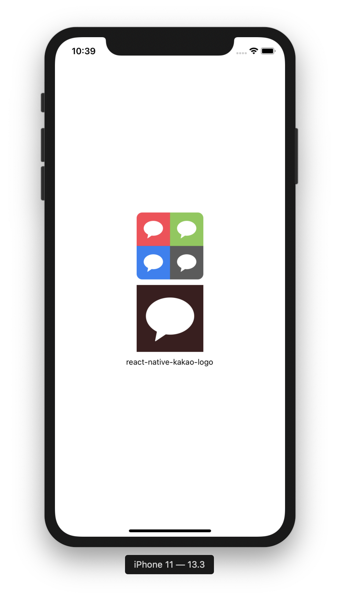

<span class="module"><a href="https://github.com/bang9/react-native-kakao-logo" title="View this project"></a></span>

<span class="npmversion"><a href="https://npmjs.org/package/react-native-kakao-logo" title="View this project on NPM"></a></span>
<span class="npmdownloads"><a href="https://npmjs.org/package/react-native-kakao-logo" title="View this project on NPM"></a></span>

# react-native-kakao-logo

(not official) Kakao svg-logo for React Native

### Required

install `react-native-svg`

### Preview


### Example code and screenshot

```jsx
import React from 'react';
import {SafeAreaView, StyleSheet, StatusBar, Text, View} from 'react-native';
import KakaoLogo from 'react-native-kakao-logo';

const options = [
  {
    backgroundColor: '#ff4253',
    padding: 10,
  },
  {
    backgroundColor: '#81ca4e',
    padding: 10,
  },
  {
    backgroundColor: '#297ef5',
    padding: 10,
  },
  {
    backgroundColor: '#5b5b5b',
    padding: 10,
  },
];

const App = () => {
  return (
    <>
      <StatusBar barStyle={'dark-content'} />
      <SafeAreaView style={styles.safeArea}>
        <View style={styles.container}>
          {options.map(option => {
            return (
              <KakaoLogo
                key={option.backgroundColor}
                style={option}
                size={40}
                color={'white'}
              />
            );
          })}
        </View>
        <KakaoLogo style={styles.logo} size={100} color={'white'} />
        <Text>react-native-kakao-logo</Text>
      </SafeAreaView>
    </>
  );
};

const styles = StyleSheet.create({
  safeArea: {alignItems: 'center', justifyContent: 'center', flex: 1},
  container: {
    width: 120,
    justifyContent: 'center',
    flexWrap: 'wrap',
    flexDirection: 'row',
    borderRadius: 10,
    overflow: 'hidden',
  },
  logo: {
    backgroundColor: '#3c1e1e',
    padding: 10,
    margin: 10,
  },
});

export default App;
```


### Props

| Prop   | Type      | Default | Description        |
| :----- | :-------- | :------ | :----------------- |
| size?  | number    | 25      | Logo size          |
| color? | string    | #3C1E1E | Logo color         |
| style? | ViewStyle | none    | Logo Wrapper Style |
